# Newrelic
---------------------------------------------------------------------------------
* my windows server
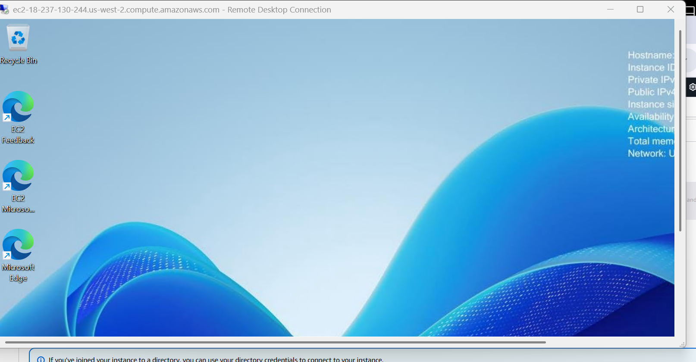
* powershell terminal 
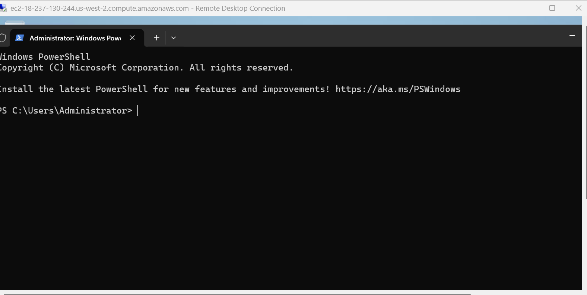
* [Refere Here](https://docs.newrelic.com/docs/infrastructure/infrastructure-agent/windows-installation/windows-msi-installer/) for guided installation.
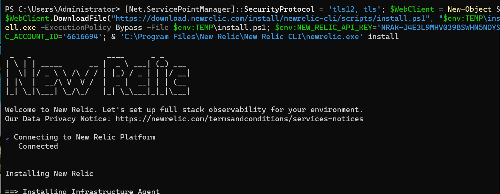
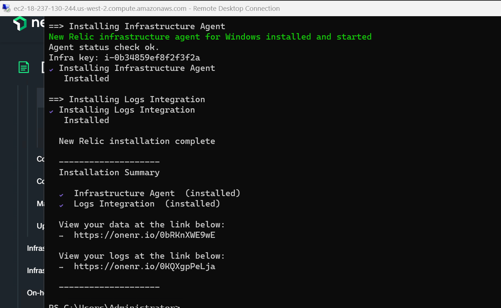
### agent integration
-----------------------------------------------
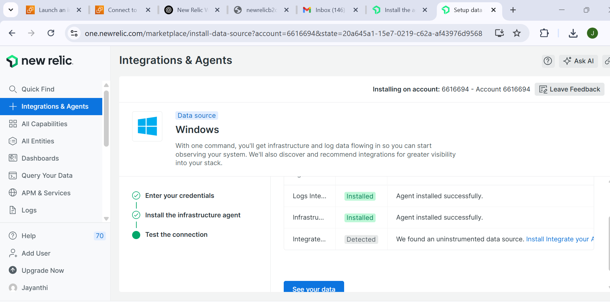
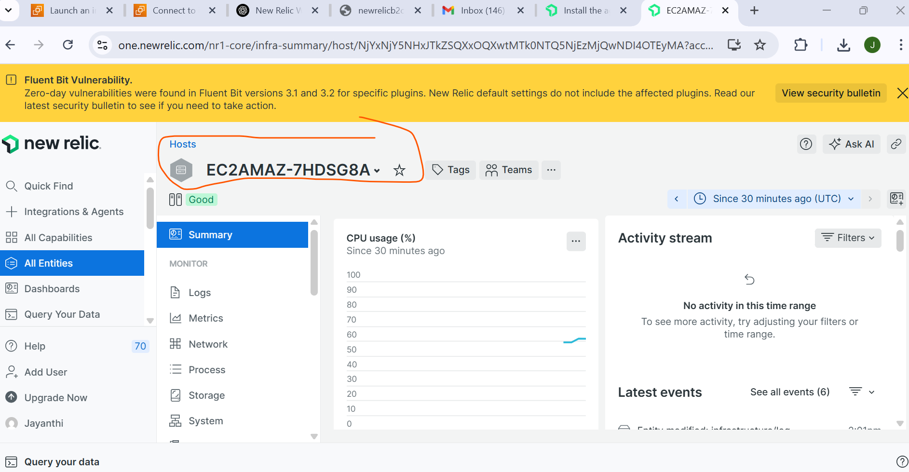
* agent integrated sucessfully.
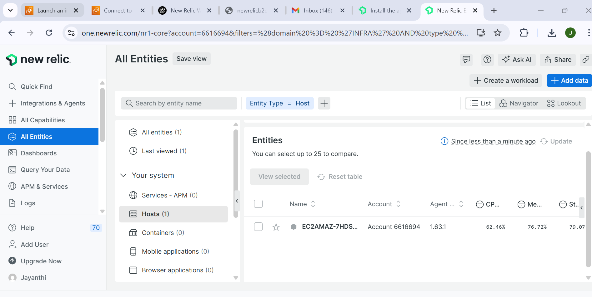
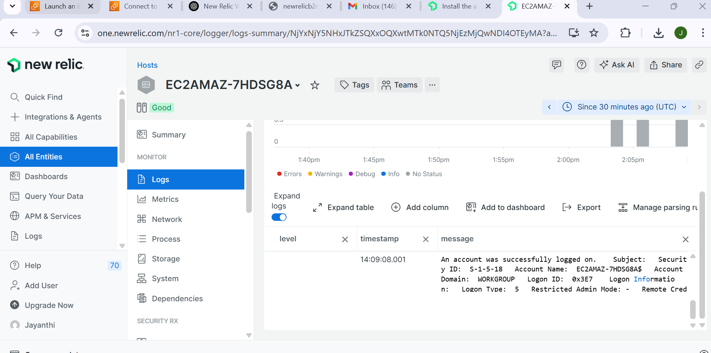
* integrate linux host also.
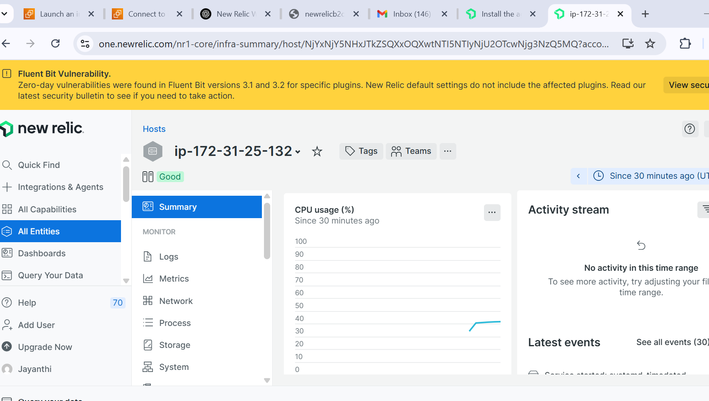
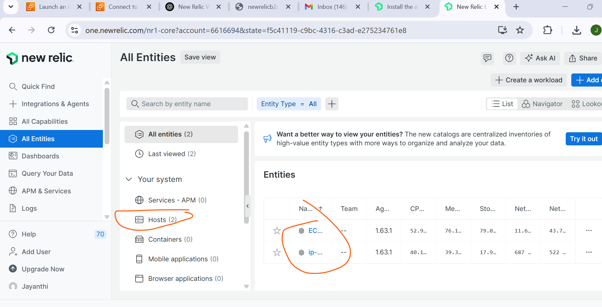
* APM
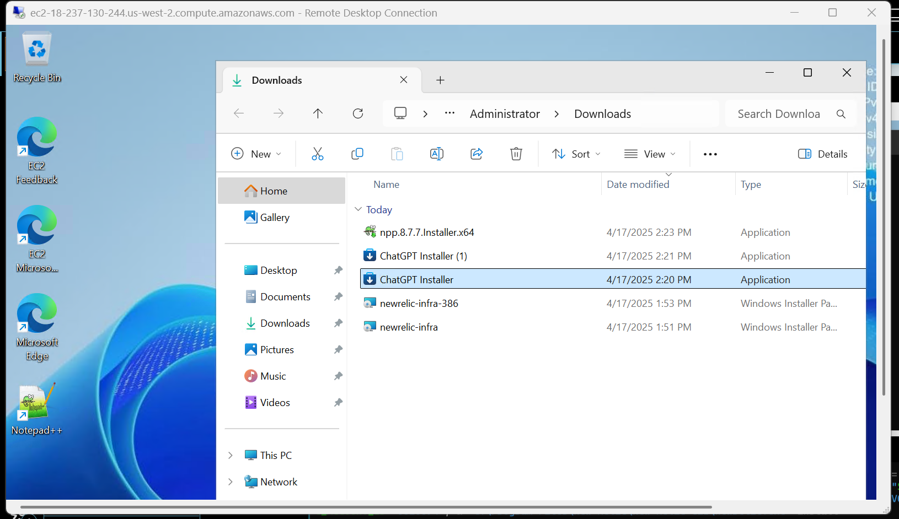
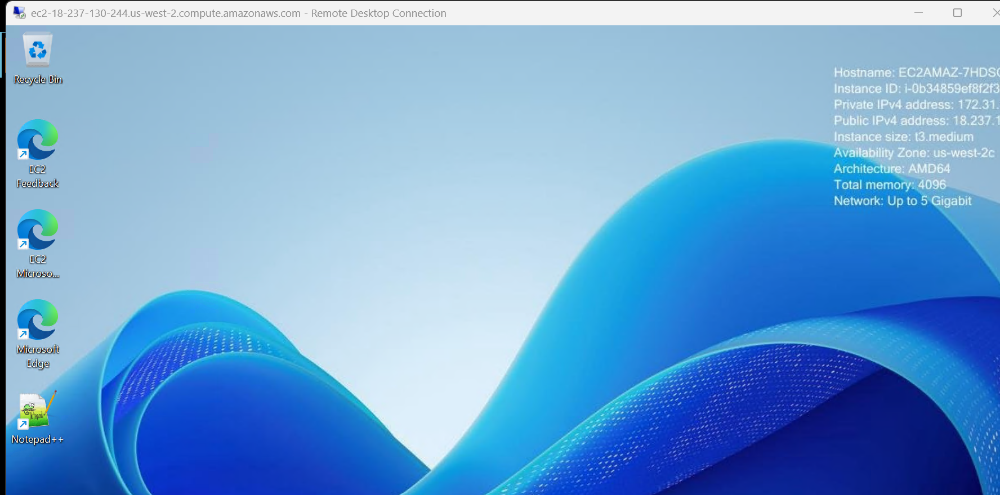
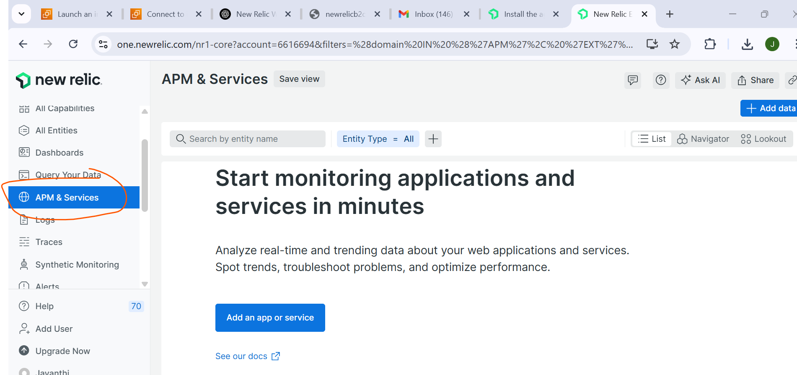

